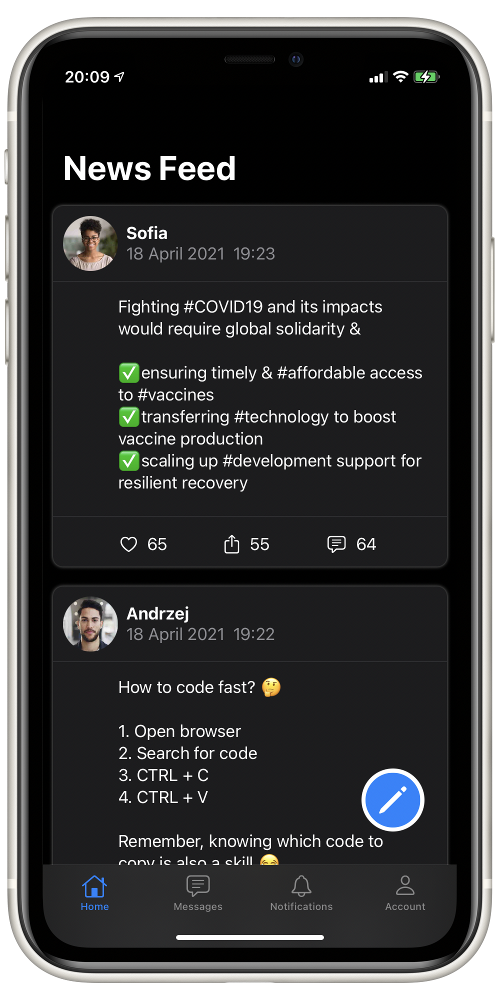
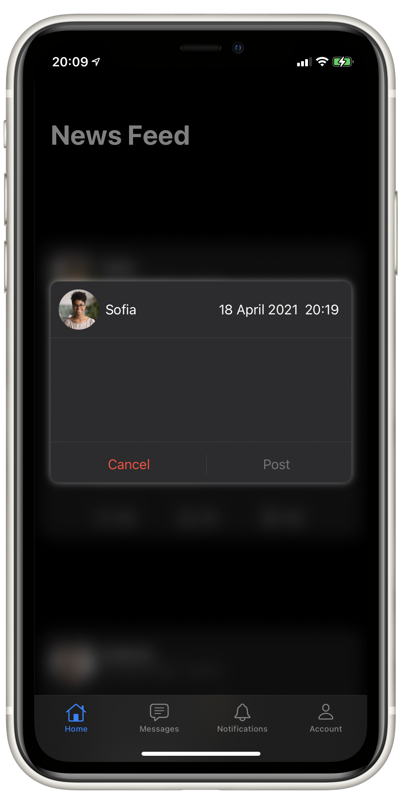
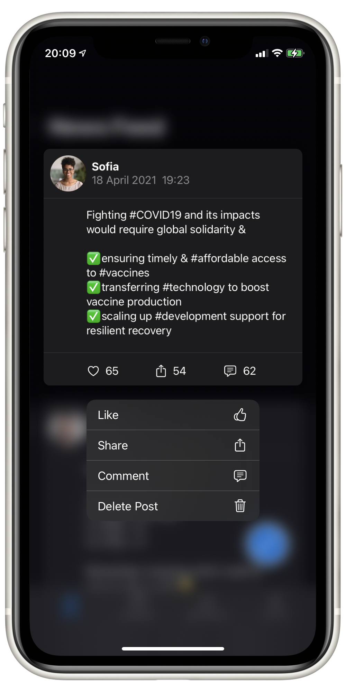
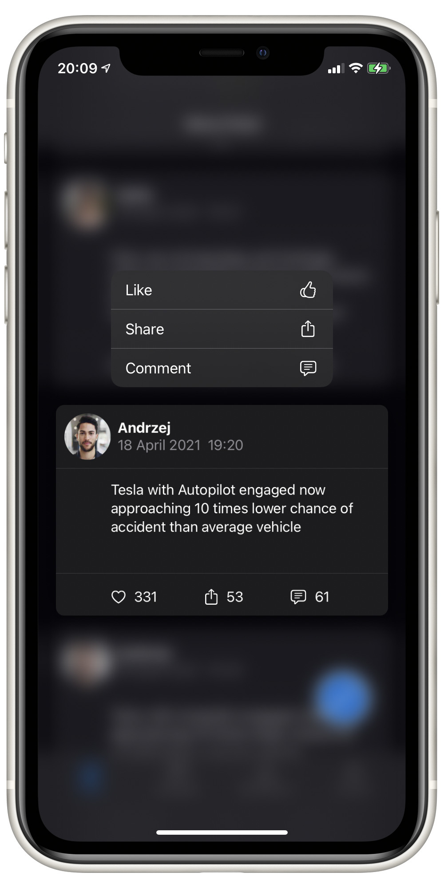
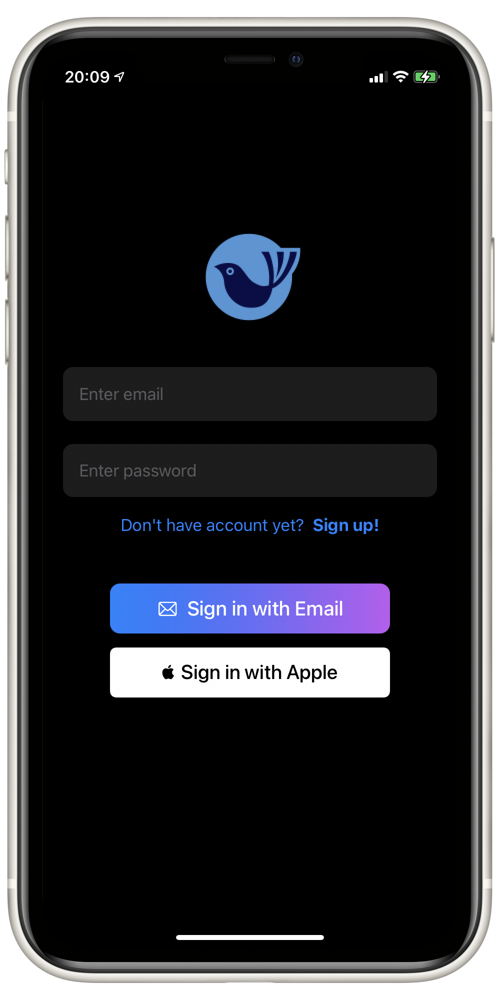
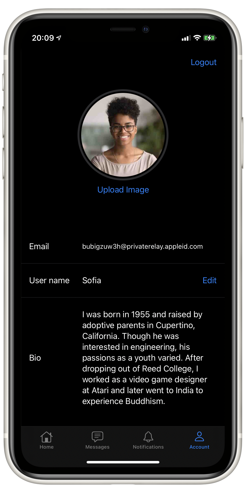

# Social Media App

>Social media app is perfect place for news sharing and connecting with other people. 

## News Feed & New Post 
 

 
 
 

## Quick Actions Menu
 

 

 ## Login & Settings View 
  

  
   

 
  
  

## Tech
Social Media App uses a number of technologies:
  - [Sign In With Apple] - authentication process
  - [Firebase Authentication] - authentication process
  - [Firebase Storage] - storing images
  - [Firebase Realtime Database] - storing posts, likes
  - [Apple SwiftUI] based modern interface.
  - [Apple URLCache] for optimal network usage and app speed while downloading images.
  
 ## Features to be implemented
  - comments funcionality
  - direct share
 

[Firebase Storage]: <https://firebase.google.com/docs/storage>
[Firebase Realtime Database]: <https://firebase.google.com/docs/database>
[Firebase Authentication]: <https://firebase.google.com/docs/auth>
[Sign In With Apple]: <https://developer.apple.com/documentation/sign_in_with_apple>
[Apple SwiftUI]: <https://developer.apple.com/documentation/swiftui/>
[Apple URLCache]:<https://developer.apple.com/documentation/foundation/urlcache>
